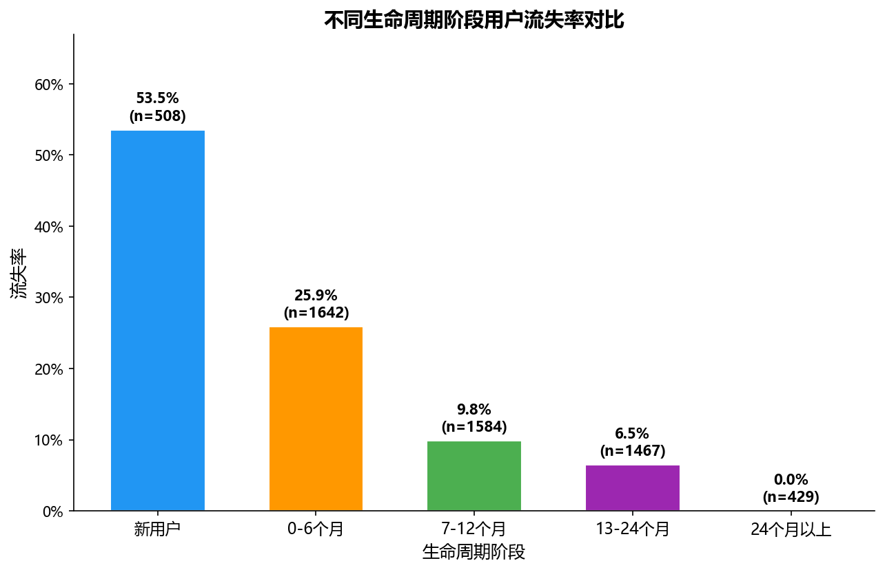
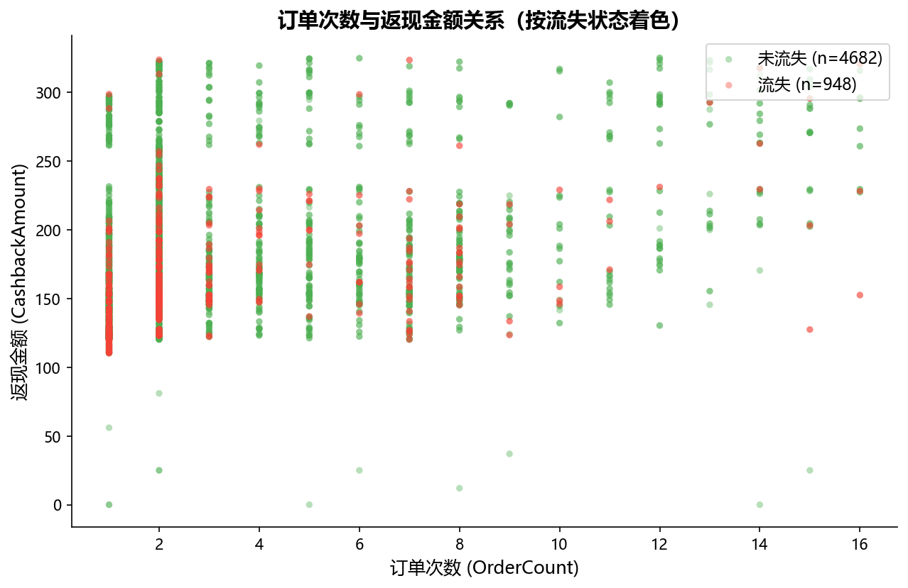
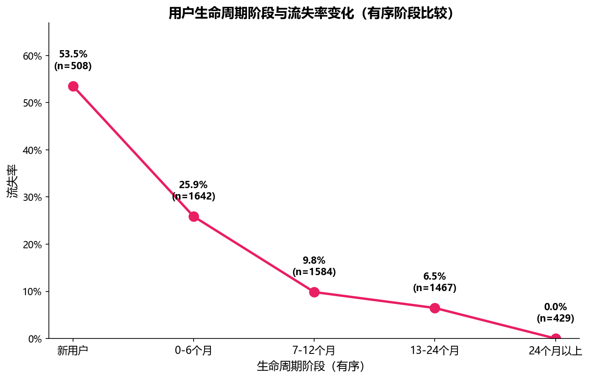
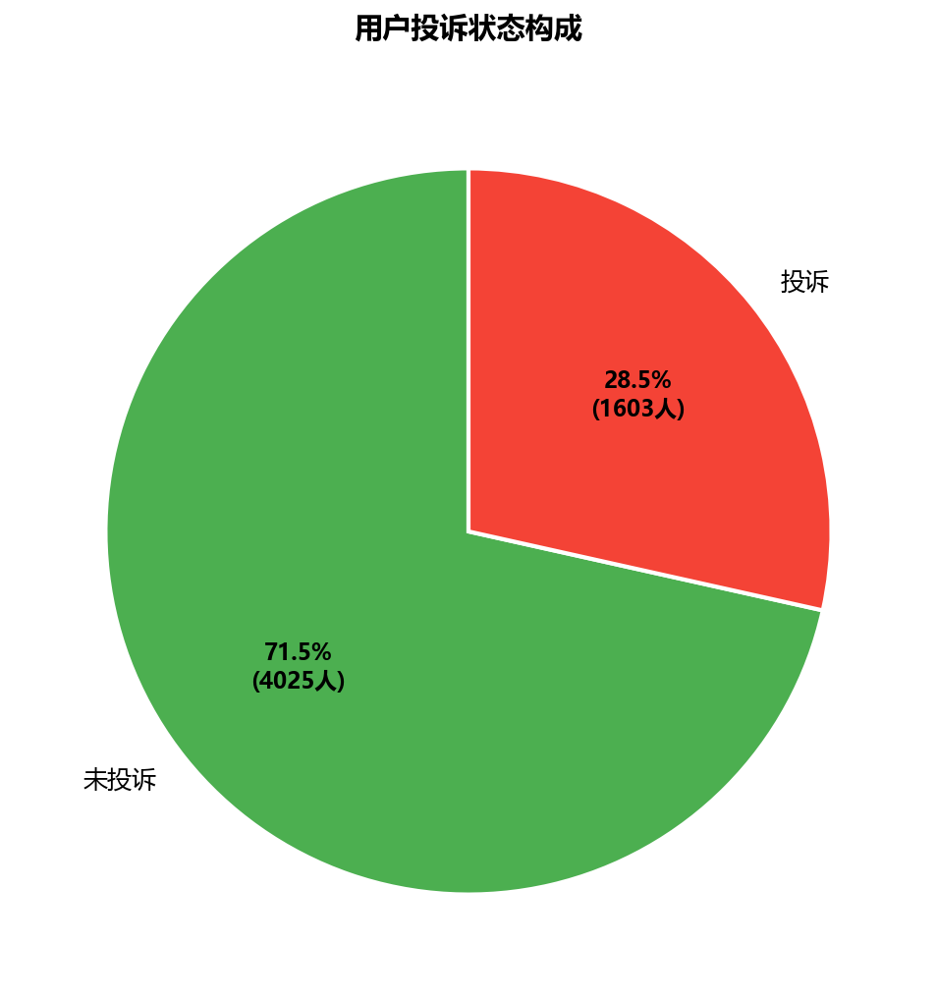
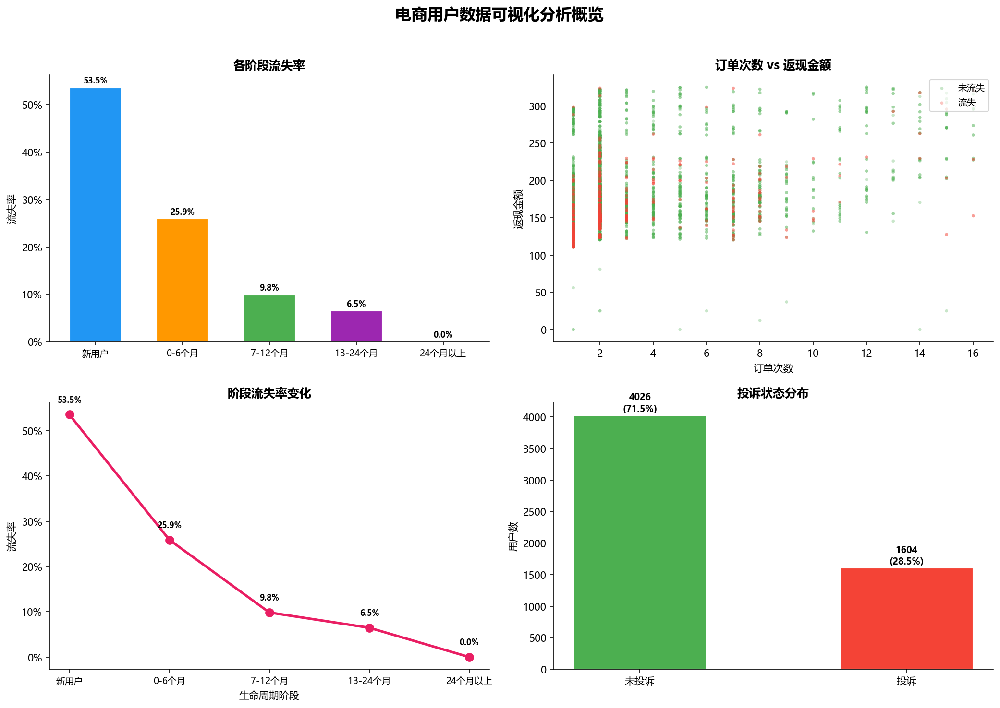

# campus-market-24012474

> 电商用户数据分析与可视化项目


## 项目概述

对 **5630 名电商用户** 的 22 个维度进行全流程数据分析，涵盖数据清洗、多维统计分析和数据可视化。本项目模拟真实电商运营场景，通过数据驱动的方式识别流失风险和用户行为模式。

### 核心业务问题
- **用户生命周期阶段**与流失率有何关联？
- **订单行为**与**返现金额**之间存在怎样的关系？
- **投诉状态**和**支付偏好**在不同用户群体中如何分布？

---

## 项目结构

```
campus-market-24012474/
├── notebooks/                    # Jupyter Notebook
│   ├── day03_pandas_product_analysis.ipynb
│   ├── day04_pm_user_cleaning_project.ipynb
│   ├── day05_pm_student_project.ipynb      # [已完成] 统计分析
│   └── day06_pm_student_visualization.ipynb # [已完成] 数据可视化
├── output/                      # 交付成果
│   ├── day04_project/           # 清洗后数据
│   ├── day05_analysis/          # 分析报告 (CSV)
│   └── day06_visualization/     # 图表与清单
├── data/                        # 原始数据
├── scripts/                     # 验证脚本
└── README.md                    # 项目介绍
```

---

## Day 5：多维统计分析

**专题 A - 用户生命周期分析**

| 指标 | 数值 |
|---|---|
| 用户总数 | 5,630 |
| 总体流失率 | **16.84%** |
| 人均订单数 | 2.96 |
| 平均返现金额 | ¥177.22 |

### 核心发现

1. **流失率随生命周期递减** — 新用户流失率高达 **53.5%**，而 24 个月以上用户流失率为 **0%**，早期留存至关重要。

2. **新用户 + 货到付款 = 72.4% 流失率** — 该组合在所有细分群体中流失风险最高，表明需要针对选择货到付款的新用户设计信任建立策略。

3. **订单数与返现金额与留存相关** — 流失用户在各生命周期阶段均表现出较低的订单频率和返现金额。

---

## Day 6：数据可视化

### 图表展示

| 图表 | 类型 | 业务问题 |
|---|---|---|
|  | **柱状图** | 各生命周期阶段的流失率对比 |
|  | **散点图** | 订单次数与返现金额的关系（按流失状态着色） |
|  | **折线图** | 有序阶段流失率变化趋势 |
|  | **构成图** | 用户投诉状态分布 |
|  | **2×2 综合看板** | 整体分析概览 |

---

## 技术栈

- **Python 3.14** | Pandas、NumPy 数据分析
- **Matplotlib** 出版级图表绘制
- **Jupyter Notebook** 交互式开发
- **Git & GitHub** 版本控制

---

## 运行方式

```bash
# 安装依赖
pip install -r requirements.txt

# 运行验证脚本
python scripts/validate_submission.py
```

---

## 验证状态

所有 Day 5 和 Day 6 交付物已通过验证脚本检查：
- [x] 3 份 CSV 分析报告
- [x] 4 张独立图表 + 1 张综合看板
- [x] 完整的图表清单（`chart_manifest.csv`）
- [x] 所有 Notebook 通过结构检查

---

*学生项目 | Steve-cza | 2026*
